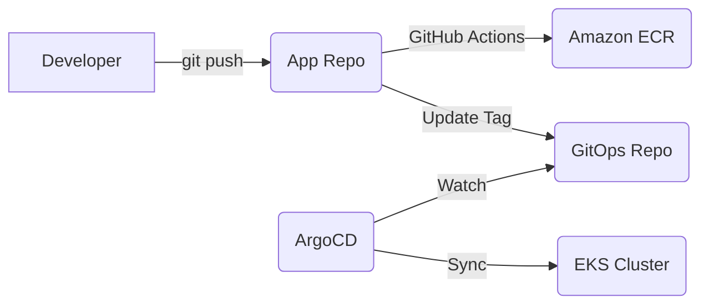

# ☸️ GitOps Architecture & Workflow

This project follows the **GitOps principles** to manage the lifecycle of the ShopScale platform. We separate the **Application Source Code** from the **Deployment Manifests** to ensure stability, security, and a clear audit trail.

---

## 🏗️ Dual-Repository Strategy

We use two distinct repositories to manage the environment:

1.  **Application Repo (Source of Code):** [amr-elzoghby/High-Scale-Ecommerce-K8s-15K-Concurrent](https://github.com/amr-elzoghby/High-Scale-Ecommerce-K8s-15K-Concurrent)
    *   Contains microservices source code.
    *   Contains Dockerfiles.
    *   Triggers CI/CD Pipelines (GitHub Actions).
2.  **GitOps Repo (Source of Truth):** [amr-elzoghby/web-app-gitops](https://github.com/amr-elzoghby/web-app-gitops)
    *   Contains pure Kubernetes manifests (YAML).
    *   Organized by service (`apps/frontend`, `apps/catalog`, etc.).
    *   Managed and synchronized by **ArgoCD**.

---

## 🔄 The Sync Workflow

### 1. Continuous Integration (CI)
When code is pushed to the App Repo, GitHub Actions:
- Authenticates with AWS via **OIDC**.
- Builds and pushes a new image version to **Amazon ECR**.
- Performs a `sed` replacement on the `deployment.yaml` in the GitOps Repo to update the image tag.

### 2. Continuous Delivery (CD)
**ArgoCD** is installed inside the EKS cluster and:
- Polls the GitOps repository for changes.
- Automatically synchronizes the cluster state when a manifest change is detected.
- Ensures the running state in EKS **exactly matches** the desired state in Git.

---

## 🛡️ Security Benefits

- **No Secrets in CI:** GitHub Actions doesn't need Kubeconfig or cluster credentials. It only needs permission to update a Git repository.
- **Audit Trail:** Every deployment is a Git commit. We know exactly WHO deployed WHAT and WHEN.
- **Drift Detection:** If someone manually changes a resource in the cluster via `kubectl`, ArgoCD will detect it as "OutOfSync" and automatically revert it to match the Git manifest.

---

  Implemented with ❤️ for High-Scale Performance.

