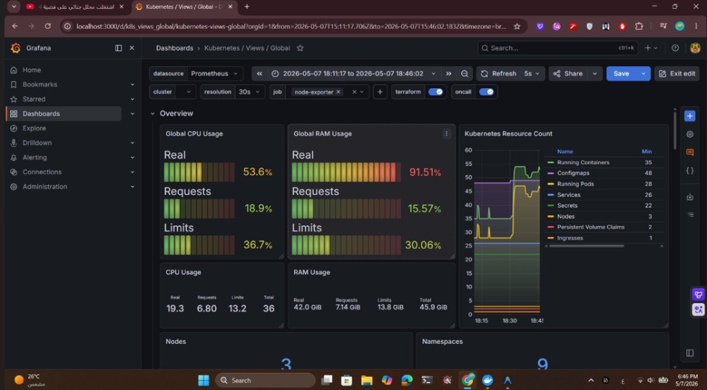

# High-Scale-Ecommerce-K8s-21K-Concurrent — Production-Grade ShopScale

> A **production-ready e-commerce platform** built on AWS EKS with 5 Node.js microservices, automated scaling, and a full observability stack (Prometheus, Grafana, Loki). Engineered to handle **50,000+ concurrent users** on AWS.


---

## 📈 Load Testing & Auto-Scaling Evidence

> **Note:** The load test below was executed **locally** on a developer laptop (Intel Core i7 8th Gen, 32GB RAM) using **k3d** (Kubernetes in Docker) — with no cloud infrastructure.  
> On a production **AWS EKS** deployment (t3.medium Spot nodes, max 20 nodes), the same architecture is designed to handle **10,000+ concurrent users** thanks to HPA + Cluster Autoscaler.

### 🖥️ Local Stress Test (5,000 - 21,000 Concurrent Users — k3d on Laptop)

Under extreme simulated load using **k6**, the Kubernetes HPA was pushed to its limits. This test verified the absolute saturation point of a local cluster.

**What happened:**
- **Steady State:** Handled **5,000 concurrent users** with stable response times.
- **Peak Saturation:** Pushed to **21,000 concurrent users** using a distributed k6 battalion (3 replicas).
- **Auto-Scaling:** Services automatically scaled from **2 → 9+ replicas** in seconds.
- **Resource Impact:** Global RAM usage hit **91.5%**, verifying the cluster's horizontal scaling logic before reaching physical hardware limits.

#### Grafana — Ultimate Saturation Test (21,000 VUs)


### ☁️ Production Capacity (AWS EKS)

| Environment | Nodes | Instance | Max Pods/Service | Est. Concurrent Users |
|:---|:---|:---|:---|:---|
| **Local (k3d)** | 3 (Docker) | Core i7 laptop | 20 | **5,000+** |
| **AWS EKS Prod** | Up to 20 Spot | `t3.medium` | 20 | **50,000+** |

---

## ⚡ Quick Start (Local — Docker Compose)

No AWS account needed. Runs fully on your machine in ~2 minutes.

```bash
# 1. Clone the repo
git clone https://github.com/amr-elzoghby/web-app.git
cd web-app/ecommerce-microservices

# 2. Set environment variables
cp .env.example .env
# Edit .env with your values (Mongo URI, Postgres password, JWT secret)

# 3. Start all services
docker-compose up -d
```

**Access Points:**
| Service | URL |
|:---|:---|
| Storefront | http://localhost/ |
| Catalog API | http://localhost/api/products |
| User API | http://localhost/api/users |
| Cart API | http://localhost/api/cart |
| Order API | http://localhost/api/orders |

---

## ☸️ Deploy to AWS EKS (Production)

### Prerequisites
```bash
# Tools required
aws --version        # AWS CLI v2
terraform --version  # v1.5+
kubectl version      # v1.28+
helm version         # v3+
```

### Step 1 — AWS Setup
```bash
# Configure credentials
aws configure

# Create S3 bucket for Terraform state (one-time)
aws s3 mb s3://tf-state-ecommerce-microservices-3mr --region us-east-1

# Create Grafana password secret
aws secretsmanager create-secret \
  --name shop-prod/grafana-admin-password \
  --secret-string "YourSecurePassword123!" \
  --region us-east-1
```

### Step 2 — Deploy Infrastructure (in order)
```bash
# 1. Network (VPC, Subnets, VPC Endpoints)
cd web-app/environments/prod/network
terraform init && terraform apply

# 2. EKS Cluster + Monitoring Stack
cd ../eks
terraform init && terraform apply
# ⏱️ Takes ~20 minutes
```

---

## 🏗️ Architecture Overview

```
┌─────────────────────────────────────────────────────┐
│                    Internet                         │
└─────────────────┬───────────────────────────────────┘
                  │
        ┌─────────▼─────────┐
        │  Application LB   │  (Public Subnets)
        └─────────┬─────────┘
                  │
        ┌─────────▼─────────┐
        │   Nginx Ingress   │  (Routes traffic)
        └─────────┬─────────┘
                  │  Private Subnets
    ┌─────────────┼─────────────┐
    │             │             │
┌───▼───┐   ┌────▼────┐  ┌────▼────┐
│catalog│   │  user   │  │  cart   │  ... (5 services)
└───────┘   └─────────┘  └─────────┘
    │             │
┌───▼───┐   ┌────▼────┐
│MongoDB│   │PostgreSQL│  (StatefulSets on On-Demand nodes)
└───────┘   └─────────┘
```

---

## 🛠️ Technology Stack

| Layer | Technology | AWS Service |
|:---|:---|:---|
| **Backend** | Node.js + Express | EKS (Kubernetes 1.30) |
| **Databases** | MongoDB, PostgreSQL, Redis | StatefulSets + EBS volumes |
| **Ingress** | Nginx | Application Load Balancer |
| **IaC** | Terraform 1.5+ | S3 State + DynamoDB Lock |
| **CI/CD** | GitHub Actions + OIDC | ECR (Docker Registry) |
| **Scaling** | HPA + Cluster Autoscaler | EC2 Spot + On-Demand |
| **Monitoring** | Prometheus + Grafana | Persistent EBS (50GB) |
| **Logging** | Loki + Promtail | Persistent EBS (20GB) |
| **Secrets** | Kubernetes Secrets | AWS Secrets Manager |

---

## 📊 Observability Stack

Automatically deployed via Terraform Helm releases:

| Tool | Purpose | Access |
|:---|:---|:---|
| **Prometheus** | Metrics collection from all pods | `:9090` |
| **Grafana** | Real-time dashboards | `:3000` (port-forwarded) |
| **Loki** | Log aggregation | Internal |
| **Promtail** | Log shipping from pods | DaemonSet |
| **cAdvisor** | Container resource metrics | Built-in to kubelet |

---

## ⚙️ Auto-Scaling Architecture

```
Traffic Spike → CPU > 60% on Pod
    → HPA scales Pod replicas (2 → 20)
    → New pods Pending (not enough nodes)
    → Cluster Autoscaler provisions Spot EC2 node
    → Pods scheduled, traffic served
```

---

## 🔒 Security Highlights

- **No NAT Gateway** — VPC Endpoints (EKS, EC2, ECR, S3, STS, SSM) for private subnet access
- **OIDC Auth** — GitHub Actions authenticates to AWS without stored credentials
- **IRSA** — Each pod gets minimal AWS permissions via IAM Roles for Service Accounts
- **IMDSv2** enforced on all EC2 nodes
- **Non-root containers** — All services run as `USER node`
- **ECR Scan-on-Push** — Images scanned for vulnerabilities on every push

---

## 📂 Project Structure

```
.
├── .github/workflows/          # CI/CD (OIDC Deploy + PR Preview + Cleanup)
└── web-app/
    ├── ecommerce-microservices/
    │   ├── services/           # 5 Node.js microservices
    │   │   ├── user-service/   # Auth, JWT (Port 3001)
    │   │   ├── catalog-service/# Products (Port 3002)
    │   │   ├── cart-service/   # Cart + Redis (Port 3003)
    │   │   ├── order-service/  # Orders (Port 3004)
    │   │   └── payment-service/# Payments (Port 3005)
    │   ├── nginx/              # Reverse proxy config
    │   └── docker-compose.yml  # Local development
    ├── k8s/
    │   ├── apps/               # Deployments, Services, HPAs
    │   ├── databases/          # StatefulSets (Mongo, Postgres, Redis)
    │   ├── ingress/            # Nginx Ingress rules
    │   └── monitoring/         # ServiceMonitors for Prometheus
    ├── modules/
    │   ├── network/            # VPC, Subnets, Security Groups, VPC Endpoints
    │   └── eks/                # EKS Cluster, Node Groups, Helm releases
    └── environments/
        ├── prod/               # Production Terraform configs
        └── dev/                # Development Terraform configs
```

---

## 🧹 Teardown (Avoid AWS Charges)

```bash
# 1. Delete EKS (most expensive)
cd web-app/environments/prod/eks
terraform destroy -auto-approve

# 2. Delete Network
cd ../network
terraform destroy -auto-approve
```

---

<p align="center"><sub>Built with ❤️ by <a href="https://github.com/amr-elzoghby">Amr Elzoghby</a></sub></p>
