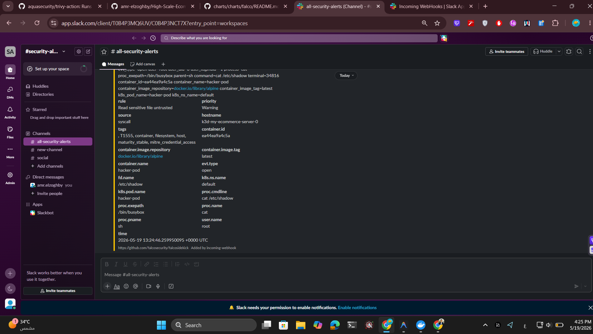

<div align="center">


# High-Scale E-Commerce on Kubernetes

[](https://github.com/amr-elzoghby/High-Scale-Ecommerce-K8s-15K-Concurrent/actions)
[](LICENSE)
[](https://kubernetes.io)
[](https://terraform.io)
[](https://aws.amazon.com/eks/)

Production-grade e-commerce platform running **5 polyglot microservices** (Node.js + Python FastAPI) with a **static frontend**, deployed on **AWS EKS**.<br/>
Engineered to handle **15,000+ concurrent users** via HPA + Karpenter.

[Quick Start](#-quick-start) · [Architecture](#-architecture) · [Deploy to AWS](#-deploy-to-aws-eks) · [Teardown](#-teardown)

</div>

---

## 📑 Table of Contents

- [Load Testing & Scaling Evidence](#-load-testing--scaling-evidence)
- [GitOps & Continuous Delivery](#-gitops--continuous-delivery)
- [Quick Start](#-quick-start)
- [Deploy to AWS EKS](#-deploy-to-aws-eks)
- [Architecture](#-architecture)
- [Technology Stack](#-technology-stack)
- [Observability](#-observability)
- [Auto-Scaling & Resilience](#-auto-scaling--resilience)
- [Security](#-security)
- [Project Structure](#-project-structure)
- [Makefile Reference](#-makefile-reference)
- [Teardown](#-teardown)

---

## 📈 Load Testing & Scaling Evidence

> Load tests were executed **locally** (Intel i7 8th Gen, 32 GB RAM) using **k3d**. On production AWS EKS (t3.medium Spot, up to 20 nodes), the same architecture targets **15,000+ concurrent / 100,000+ daily users**.

### Local Stress Test — 4,000 Concurrent Users (k3d)

| Metric | Result |
|:--|:--|
| **Steady state** | 4,000 concurrent users with stable response times |
| **Peak saturation** | Hardware limits reached — scaling logic fully verified |
| **Auto-scaling** | Replicas scaled **2 → 9+** in seconds via HPA |
| **Resource ceiling** | RAM peaked at **91.5%** before hardware saturation |

<details>
<summary><strong>📊 Grafana Dashboard — Saturation Test (4,000 VUs)</strong></summary>
<br/>

</details>

<details>
<summary><strong>🖥️ Terminal — Live Pod Auto-Scaling</strong></summary>
<br/>

<p><em>Pods transitioning from Pending → ContainerCreating → Running as HPA triggers scale-out.</em></p>
</details>

### Production Capacity Comparison

| Environment | Nodes | Instance | Max Replicas | Est. Concurrent Users |
|:--|:--:|:--:|:--:|:--:|
| **Local (k3d)** | 3 (Docker) | Core i7 laptop | 9 | 4,000 |
| **AWS EKS** | Up to 20 Spot | `t3.medium` | 20 | **15,000+** |

---

## 🔄 GitOps & Continuous Delivery

Production deployments follow a **Dual-Repository GitOps** model managed by **ArgoCD**.


**Deployment Flow:**

```
Code Push → GitHub Actions CI → Build & Push to ECR → Update GitOps Repo → ArgoCD Sync → Rolling Update on EKS
```

> [!TIP]
> The Git repository is the **single source of truth** for all infrastructure and application state. See [GITOPS.md](GITOPS.md) for details.

---

## ⚡ Quick Start

> No AWS account needed. Runs fully on your machine in ~2 minutes.

**Prerequisites:** Docker & Docker Compose (latest), Node.js v18+

```bash
# Clone & configure
git clone https://github.com/amr-elzoghby/High-Scale-Ecommerce-K8s-15K-Concurrent.git
cd High-Scale-Ecommerce-K8s-15K-Concurrent
cp .env.example .env          # Edit with your Mongo URI, Postgres password, JWT secret

# Start all services
cd web-app/ecommerce-microservices
docker-compose up -d
```

| Service | URL |
|:--|:--|
| 🌐 Storefront | `http://localhost/` |
| 📦 Catalog API | `http://localhost/api/products` |
| 👤 User API | `http://localhost/api/users` |
| 🛒 Cart API | `http://localhost/api/cart` |
| 📋 Order API | `http://localhost/api/orders` |

---

## ☸️ Deploy to AWS EKS

**Prerequisites:** AWS CLI v2 · Terraform v1.5+ · kubectl v1.28+ · Helm v3+

### Step 1 — AWS Setup

```bash
aws configure
aws s3 mb s3://tf-state-ecommerce-microservices-3mr --region us-east-1

aws secretsmanager create-secret \
  --name shop-prod/grafana-admin-password \
  --secret-string "YourSecurePassword123!" \
  --region us-east-1
```

### Step 2 — Deploy Infrastructure (4 layers, in order)

```bash
# 1. Network layer (VPC, Subnets, VPC Endpoints)
cd web-app/environments/prod/network
terraform init && terraform apply

# 2. Storage layer (S3 buckets)
cd ../storage
terraform init && terraform apply

# 3. EKS Cluster + Monitoring (~20 min)
cd ../eks
terraform init && terraform apply

# 4. Compute layer (Node Groups, ALB, ECR, Lambda)
cd ../compute
terraform init && terraform apply
```

### One-Click Alternative (Makefile)

```bash
make up        # Full production deployment
make local-up  # Local k3d cluster (no AWS charges)
```

---

## 🏗️ Architecture


```
                      Internet
                         │
                ┌────────▼────────┐
                │  Application LB │   Public Subnets
                └────────┬────────┘
                ┌────────▼────────┐
                │  Nginx Ingress  │   Routes traffic
                └────────┬────────┘
                         │  Private Subnets
          ┌──────────────┼──────────────┐
          │              │              │
     ┌────▼────┐   ┌────▼────┐   ┌────▼────┐
     │ catalog │   │  user   │   │  cart   │   ... (5 services)
     └────┬────┘   └────┬────┘   └─────────┘
     ┌────▼────┐   ┌────▼──────┐
     │ MongoDB │   │ PostgreSQL│   StatefulSets on On-Demand nodes
     └─────────┘   └───────────┘
```

### Dual-Protocol Communication (REST + gRPC)

| Service | Protocol | Ports | Used By |
|:--|:--|:--:|:--|
| **cart-service** | REST | `3003` | Browser |
| **catalog-service** | REST | `3002` | Browser |
| **payment-service** | REST + gRPC | `3005` + `50051` | Browser + Internal |
| **order-service** | REST + gRPC | `3004` + `50052` | Browser + Internal |

> **Why gRPC?** Payment & Order handle latency-sensitive checkout flows. Protocol Buffers serialize ~7× faster than JSON with strict typed contracts via `.proto` schemas.

---

## 🛠️ Technology Stack

| Layer | Technology | AWS Service |
|:--|:--|:--|
| **Backend** | Node.js (Express) · Python (FastAPI) | EKS (K8s 1.30) |
| **Communication** | REST (HTTP/JSON) · gRPC (Protobuf) | Internal K8s DNS |
| **Auth** | JWT RS256 (RSA-4096) · 15 min access · 7d httpOnly refresh | K8s Secrets |
| **Databases** | MongoDB · PostgreSQL · Redis (7-day TTL) | StatefulSets + EBS |
| **Ingress** | Nginx | Application LB |
| **IaC** | Terraform 1.5+ | S3 + DynamoDB Lock |
| **CI/CD** | GitHub Actions + OIDC | ECR |
| **Scaling** | HPA + Karpenter | EC2 Spot + On-Demand |
| **Monitoring** | Prometheus + Grafana | EBS (50 GB) |
| **Logging** | Loki + Promtail | EBS (20 GB) |
| **Secrets** | K8s Secrets + AWS Secrets Manager | IRSA |

---

## 📊 Observability

Deployed automatically via **Terraform Helm releases** — zero manual config.

| Tool | Purpose | Access |
|:--|:--|:--:|
| **Prometheus** | Metrics collection | `:9090` |
| **Grafana** | Dashboards & alerting | `:3000` |
| **Loki** | Log aggregation | Internal |
| **Promtail** | Log shipping (DaemonSet) | DaemonSet |
| **cAdvisor** | Container resource metrics | Kubelet built-in |

```bash
kubectl port-forward svc/grafana 3000:3000 -n monitoring
```

---

## ⚙️ Auto-Scaling & Resilience

```
Traffic Spike → CPU > 60–80% → HPA scales pods (2 → 20) → Karpenter provisions Spot nodes (~30s) → Traffic served ✅
Traffic Drop  → HPA reduces replicas → Karpenter consolidates idle nodes → Cost drops automatically
```

### Self-Healing

- **Readiness Probes** — prevent routing to uninitialized pods; guarantee zero-downtime rolling updates.
- **Liveness Probes** — detect deadlocks; Kubernetes auto-restarts unhealthy containers.

### Data Integrity

- **Payments** — PostgreSQL with ACID transactions, `Numeric(10,2)` precision, and `CheckConstraint(amount > 0)`.
- **Cart** — Redis cache with dynamic **7-day TTL**; every user action renews the lease.

---

## 🔒 Security

| Control | Implementation |
|:--|:--|
| **No NAT Gateway** | VPC Endpoints for private subnet access (EKS, ECR, S3, STS, SSM) |
| **OIDC Auth** | GitHub Actions → AWS without stored credentials |
| **IRSA** | Minimal per-pod AWS permissions via IAM Roles for Service Accounts |
| **IMDSv2** | Enforced on all EC2 nodes — prevents SSRF metadata attacks |
| **Non-root containers** | All services run as `USER node` |
| **JWT RS256** | RSA-4096 private key signs tokens (user-service only); other services verify with public key |
| **Secure refresh tokens** | `httpOnly + Secure + SameSite=Strict` cookies; 15 min access / 7d rotation |
| **Stateless auth** | RS256 verification in-memory — zero DB calls per request |
| **Trivy scanning** | CI/CD blocks deployments with `CRITICAL` CVEs |
| **Falco** | eBPF runtime threat detection + Falcosidekick → Slack alerts |
| **NetworkPolicies** | Default-deny; pod-to-pod access restricted to required paths |
| **Auto TLS** | Let's Encrypt via cert-manager + forced HTTPS + HSTS |
| **Gitignored secrets** | Credentials pulled from `.env` — never committed to source |

<details>
<summary><strong>🚨 Falco Runtime Alert Example</strong></summary>
<br/>

</details>

---

## 📂 Project Structure

```
.
├── .github/workflows/            # CI/CD (OIDC Deploy + PR Preview + Cleanup)
└── web-app/
    ├── frontend/                 # Static storefront (HTML/CSS/JS)
    ├── ecommerce-microservices/
    │   ├── services/
    │   │   ├── user-service/     # Auth + JWT (Node.js)              REST :3001
    │   │   ├── catalog-service/  # Products (Node.js)                REST :3002
    │   │   ├── cart-service/     # Cart + Redis (Node.js)            REST :3003
    │   │   ├── order-service/    # Orders (Node.js)        REST :3004 + gRPC :50052
    │   │   └── payment-service/  # Payments (Python FastAPI) REST :3005 + gRPC :50051
    │   ├── nginx/                # Reverse proxy config
    │   └── docker-compose.yml    # Local development
    ├── k8s/
    │   ├── apps/                 # Deployments, Services, HPAs
    │   ├── databases/            # StatefulSets (Mongo, Postgres, Redis)
    │   ├── ingress/              # Nginx Ingress rules
    │   ├── cert-manager/         # Let's Encrypt ClusterIssuers
    │   ├── network-policies/     # Zero-Trust rules
    │   ├── namespaces/           # Namespace definitions
    │   ├── secrets/              # Secret manifests
    │   ├── karpenter/            # Karpenter CRDs
    │   │   ├── nodepool.yaml     # NodePool (Spot/On-Demand configs)
    │   │   └── ec2nodeclass.yaml # EC2 specific config (AMI, SGs)
    │   └── monitoring/           # ServiceMonitors for Prometheus
    ├── modules/
    │   ├── network/              # VPC, Subnets, SGs, VPC Endpoints
    │   ├── eks/                  # EKS Cluster, Helm releases
    │   │   ├── karpenter.tf      # Karpenter IAM & Controller setup
    │   │   └── ...
    │   ├── compute/              # Launch Template, ASG, ALB, ECR, Lambda
    │   ├── storage/              # S3 buckets
    │   ├── falco/                # Runtime security (eBPF)
    │   └── backend-setup/        # Terraform backend bootstrap
    └── environments/
        ├── prod/
        │   ├── network/          # VPC + Subnets
        │   ├── storage/          # S3
        │   ├── eks/              # EKS Cluster
        │   └── compute/          # Node Groups + ALB
        └── dev/
```

---

## 🛠️ Makefile Reference

```bash
make help       # List all available commands
make up         # Full production deployment (AWS EKS)
make down       # Destroy all infrastructure safely
make local-up   # Local k3d cluster
make local-down # Tear down local cluster
```

---

## 🧹 Teardown

> [!WARNING]
> Always destroy resources when done to avoid unexpected AWS charges.

```bash
make down
```

---

<p align="center">
  Built with ❤️ by <a href="https://github.com/amr-elzoghby">Amr Elzoghby</a>
  <br/>
  <sub>
    <a href="https://github.com/amr-elzoghby/High-Scale-Ecommerce-K8s-15K-Concurrent/blob/main/CONTRIBUTING.md">Contributing Guide</a> ·
    <a href="GITOPS.md">GitOps Repo</a>
  </sub>
</p>
