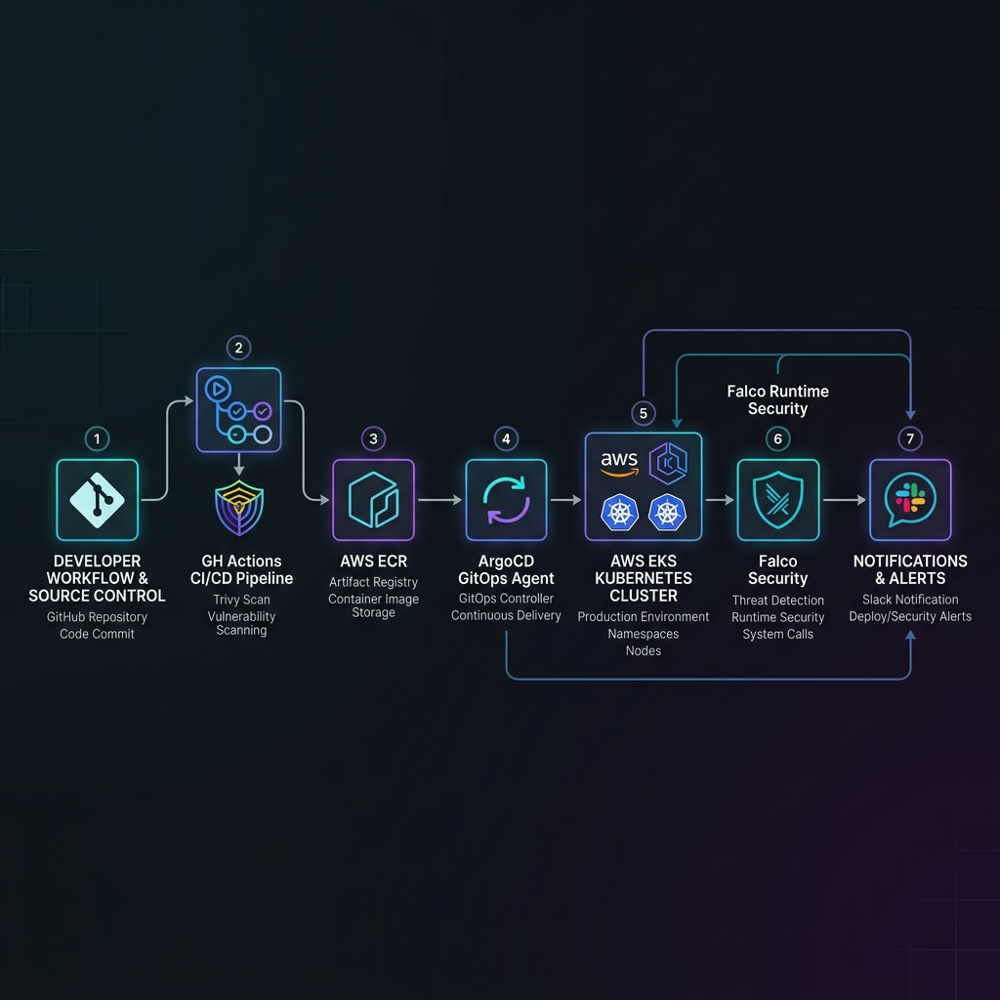

# ShopMicro — E-Commerce Microservices

> **High-availability e-commerce platform** leveraging polyglot microservices, modular Terraform, and OIDC-authenticated CI/CD pipelines. Engineered to handle **10,000+ concurrent users** with automated horizontal and cluster-level scaling.



---

### 🚀 Core DevOps Highlights

- **Cost-Optimized VPC**: Replaced NAT Gateway with **VPC Endpoints** (S3, SSM, ECR), saving ~$32/month.
- **Identity Federation**: Workflows use **GitHub OIDC** for AWS authentication (No stored secrets).
- **Auto-Scaling at Two Levels**: **HPA** scales pods on CPU pressure; **Cluster Autoscaler** adds EC2 Spot nodes when pods are pending.
- **Helm-Automated Add-ons**: Metrics Server and Cluster Autoscaler deployed via `helm_release` in Terraform — zero manual CLI commands.
- **Workload Isolation**: Microservices on **Spot nodes** (cost-optimized); Databases on **On-Demand nodes** (stability-first).
- **Security-First**: Enforced **IMDSv2**, multi-stage Docker builds (non-root), IRSA for pod-level AWS permissions, and encrypted S3 state backends.

---

### 🛠️ Technology Stack

| Layer | Tech | Infrastructure (AWS) |
| :--- | :--- | :--- |
| **Edge** | CloudFront (CDN) | SSL/HTTPS Termination |
| **Entry** | Nginx Reverse Proxy | Application Load Balancer (ALB) |
| **Backend** | Node.js, Python 3.12 | Kubernetes Pods (EKS) in Private Subnets |
| **Data** | Mongo, Postgres, Redis | S3 Customer Data (AES-256) |
| **IaC** | Terraform 1.5+ | Remote S3 State + DynamoDB Locking |
| **CI/CD** | GitHub Actions | GitOps Pattern (Production & Previews) |
| **Scaling** | HPA + Cluster Autoscaler | Helm-deployed via Terraform |

---

### 📂 Project Architecture

```bash
├── .github/workflows/    # OIDC-based CI/CD (Deploy + Preview + Cleanup pipelines)
├── web-app/
│   ├── ecommerce-microservices/ # Main App (Nginx, 5 Microservices, Compose)
│   ├── k8s/              # Kubernetes Manifests (Apps, DBs, Secrets, Ingress)
│   │   └── apps/         # HPA configs (maxReplicas: 20, CPU target: 60%)
│   ├── modules/          # Reusable IaC: [Network, Compute, Storage, IAM, EKS]
│   │   └── eks/          # EKS module: Helm releases, IRSA roles, dual node groups
│   └── environments/     # Layered Orchestration (Dev/Prod)
└── docs/images/          # System Architecture Diagrams
```

---

### 🏗️ Infrastructure as Code

Modular Terraform with **Isolated State Layers** to minimize blast radius:

1. **Network**: VPC, Public/Private Subnets, Security Groups, VPC Endpoints.
2. **Storage**: Encrypted S3 buckets with Versioning and Lifecycle policies.
3. **EKS**: Cluster + dual node groups + Metrics Server + Cluster Autoscaler (via Helm).

**Deployment Order (required — each layer depends on the previous):**
```bash
cd environments/<env>/network && terraform apply
cd environments/<env>/storage && terraform apply
cd environments/<env>/eks    && terraform apply
```

---

### ☸️ Kubernetes Orchestration (EKS)

The application runs on **Amazon EKS** with a two-tier node strategy:

#### Node Groups
| Node Group | Type | Workload | Min | Max |
| :--- | :--- | :--- | :--- | :--- |
| `workers-stable` | On-Demand | Databases (Mongo, Postgres) | 2 | 4 |
| `workers-spot` | Spot (`t3.medium`, `t3a.medium`, `t2.medium`) | Microservices | 3 | 20 |

> Spot nodes use 3 instance types as a fallback strategy — if one type is unavailable, AWS automatically provisions another.

#### Auto-Scaling Architecture
- **HPA**: Each of the 5 microservices scales **2 → 20 replicas** when CPU exceeds 60%.
- **Cluster Autoscaler**: Adds Spot EC2 nodes automatically when pods enter `Pending` state. Deployed via Terraform `helm_release` with IRSA-secured IAM permissions.
- **Metrics Server**: Auto-deployed via Helm — feeds real-time CPU/Memory data to the HPA.

#### Other Key Features
- **Namespaces**: `ecommerce-apps`, `ecommerce-data`, `ecommerce-ingress` for clean separation.
- **StatefulSets**: Databases use `PersistentVolumeClaims` — data survives pod restarts.
- **Secrets Management**: Kubernetes `Secret` objects injected at runtime, never in source control.
- **Control Plane Logging**: API, Audit, and Authenticator logs streamed to CloudWatch.

---

### 🔄 CI/CD Pipelines

#### Production Delivery (`main` branch)
1. **OIDC Auth**: GitHub assumes `GitHubActionRole` via OIDC (no stored secrets).
2. **Build**: Multi-stage Docker build → Push to **Amazon ECR**.
3. **Deploy**: `kubectl set image` for zero-downtime rolling updates.

#### PR Preview Environments
Labeling a PR with `pr-deploy` spins up a temporary environment, automatically cleaned up on PR close.

---

### 🔒 Security Implementation

- **Compute**: Nodes in **Private Subnets**; SSH disabled (Access via EKS API and SSM).
- **Network**: Strict SG rules (ALB → Pods → DB); VPC Endpoints for internal traffic.
- **Docker**: All images pass **ECR Scan-on-Push**; services run as `USER node` (non-root).
- **IAM**: Pod-level AWS access via **IRSA** — Cluster Autoscaler gets only the permissions it needs, not full node-level access.
- **IaC**: State files encrypted at rest; sensitive variables injected at runtime.

---

### 🚦 Quick Start

**Local Development:**
```bash
cp .env.example .env
cd web-app/ecommerce-microservices && docker-compose up -d
```

**Access Points:**
- **Storefront**: `http://localhost/`
- **Catalog API**: `http://localhost/api/products`
- **User API**: `http://localhost/api/users`

---

### 🤝 Collaboration & Development

- [CONTRIBUTING.md](./CONTRIBUTING.md) — How to contribute and code standards.
- [web-app/environments/README.md](./web-app/environments/README.md) — Detailed infra deployment order.

**Quick Setup Checklist:**
1. Configure AWS CLI with `AdministratorAccess`.
2. Install Terraform `v1.5+`, Docker Desktop, and `helm` CLI.
3. Use `terraform fmt` before every commit.

<p align="center"><sub>Built with ❤️ by Amr Elzoghby</sub></p>
